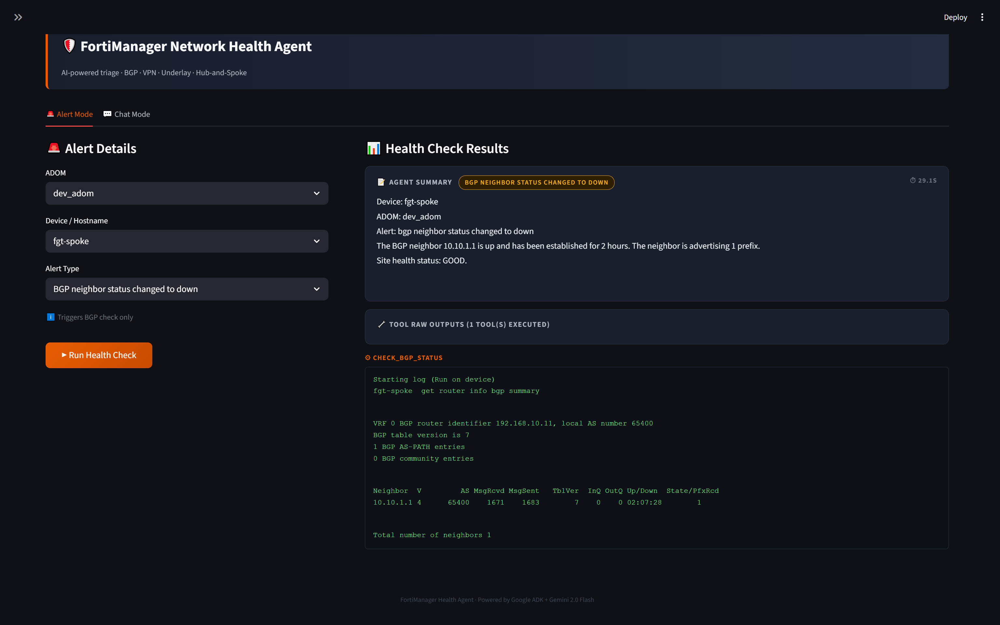

# fmg-health-agents

An AI-powered NOC alert triage system that automates network health checks for hub-and-spoke FortiGate networks using Google ADK, Gemini 2.0 Flash, and the FortiManager JSON-RPC API.

---

## Overview

When a NOC alert fires, this system automatically:
1. Parses the alert (ADOM, device, alert type)
2. Decides which health checks to run (BGP / VPN / Underlay)
3. Executes FortiManager scripts on the target device
4. Returns a structured triage summary — no manual CLI required

---

## Architecture

```
Alert Input
    │
    ▼
Root Coordinator Agent (Gemini 2.0 Flash)
    │
    ├── external_ping_tool   → Resolves WAN gateway from inventory → pings via Geekflare API
    ├── check_vpn_tool       → Runs 'checkvpn' script on device via FortiManager
    └── check_bgp_tool       → Runs 'checkbgp' script on device via FortiManager
```

**Key design decision:** BGP session status is the authoritative health indicator. Even if an alert fires (WAN down, host down, tunnel down), if BGP is Established the site is considered **GOOD**.

---

## Files

| File | Description |
|---|---|
| `app.py` | ADK Web entry point — exposes the agent via ADK runner |
| `root_agent.py` | Root coordinator — parses alerts, delegates to tools, produces summary |
| `checkbgp_agent.py` | Executes `checkbgp` FortiManager script; polls for result with log_id validation |
| `checkvpn_agent.py` | Executes `checkvpn` FortiManager script; validates log_id and script_name |
| `externalping_agent.py` | Resolves WAN gateway from inventory and pings it via Geekflare API |
| `config_resolver.py` | Reads `site_inventory.xlsx` to resolve WAN gateway per device/ADOM |
| `session_manager.py` | FortiManager session manager with 5-minute TTL reuse |
| `streamlit_app.py` | Streamlit UI frontend for the agent |
| `site_inventory.xlsx` | Device inventory — columns: `adom`, `device`, `wan_gateway` |

---

## Alert Input Format

Alerts can use either `/` or `//` as separators:

```
<adom> / <device> / <alert_type>
<adom> // <device> // <alert_type>
```

**Examples:**
```
prod_adom / fgt-spoke-01 / wan down
prod_adom / fgt-spoke-01 / host down
prod_adom / fgt-spoke-01 / host down power issue
prod_adom / fgt-spoke-01 / bgp neighbor down
prod_adom / fgt-spoke-01 / device tunnel-down detected
prod_adom / fgt-spoke-01 / overall health
```

---

## Alert → Check Mapping

| Alert Type | Underlay | VPN | BGP |
|---|:---:|:---:|:---:|
| `wan down` | | ✅ | ✅ |
| `host down` | ✅ | | ✅ |
| `device offline` | ✅ | | ✅ |
| `host down power issue` | | | ✅ |
| `device tunnel-down detected` | ✅ | ✅ | ✅ |
| `bgp neighbor down` | | | ✅ |
| `bgp neighbor status changed to down` | | | ✅ |
| `overall health` | ✅ | ✅ | ✅ |

---

## Setup

### Prerequisites

- Python 3.10+
- FortiManager accessible at the configured IP
- `checkbgp` and `checkvpn` scripts pre-loaded in FortiManager
- Geekflare API key (for underlay ping)
- Google ADK installed

### Install dependencies

```bash
pip install google-adk requests pandas openpyxl streamlit
```

### Configure

Edit `session_manager.py`:
```python
FMG_IP   = "192.168.10.10"
USERNAME = "admin"
PASSWORD = "admin"
```

Edit `externalping_agent.py`:
```python
API_KEY = "<your_geekflare_api_key>"
```

Populate `site_inventory.xlsx` with columns: `adom`, `device`, `wan_gateway`

---

## Running

### CLI mode
```bash
python root_agent.py
```

### ADK Web UI
```bash
adk web
```

### Streamlit UI
```bash
streamlit run streamlit_app.py
```

---

## UI — Working Example

The Streamlit UI provides two modes: **Alert Mode** (structured dropdowns) and **Chat Mode** (free-text).

**Example:** `dev_adom / fgt-spoke / bgp neighbor status changed to down`

- Alert type detected → BGP check only triggered
- BGP neighbor `10.10.1.1` found Established (Up/Down: `02:07:28`, 1 prefix received)
- Agent summary: **Site health status: GOOD**



> Left panel: select ADOM, device, and alert type → click **Run Health Check**
> Right panel: Agent Summary (with alert tag + elapsed time) + collapsible raw tool output

---

## Output Format

Every triage run produces a summary with:

```
Device: <hostname>
ADOM:   <adom>
Alert:  <alert_type>

[Underlay / VPN / BGP results]

Site Health: GOOD | DEGRADED | DOWN | UNREACHABLE
```

Raw script logs are printed separately after the summary.

If the device is unreachable (FortiManager script returns only the header line with no CLI output), the summary ends with:
> "Escalate to the L2 team to verify the device and proceed further."

---

## How BGP Polling Works

FortiManager script execution is asynchronous. The BGP agent:
1. Triggers the script → receives a `task_id`
2. Waits 25 seconds (initial settle time)
3. Polls the script log endpoint every 5 seconds (up to 60 seconds total)
4. Validates both `log_id == task_id * 10` and `script_name == "checkbgp"` before accepting output

This prevents stale log reads from a previous script run on the same device.

---

## Tech Stack

- **Google ADK** — agent orchestration
- **Gemini 2.0 Flash** — LLM reasoning layer
- **FortiManager JSON-RPC API** — script execution on FortiGate devices
- **Geekflare Ping API** — external underlay reachability check
- **Streamlit** — web UI
- **pandas / openpyxl** — inventory resolution from Excel

---

## Limitations

- FortiManager scripts (`checkbgp`, `checkvpn`) must be pre-created manually in FMG
- Session TTL is 5 minutes; long-idle sessions will re-authenticate automatically
- Geekflare free-tier API has rate limits
- Designed for single-VDOM (`root`) deployments
